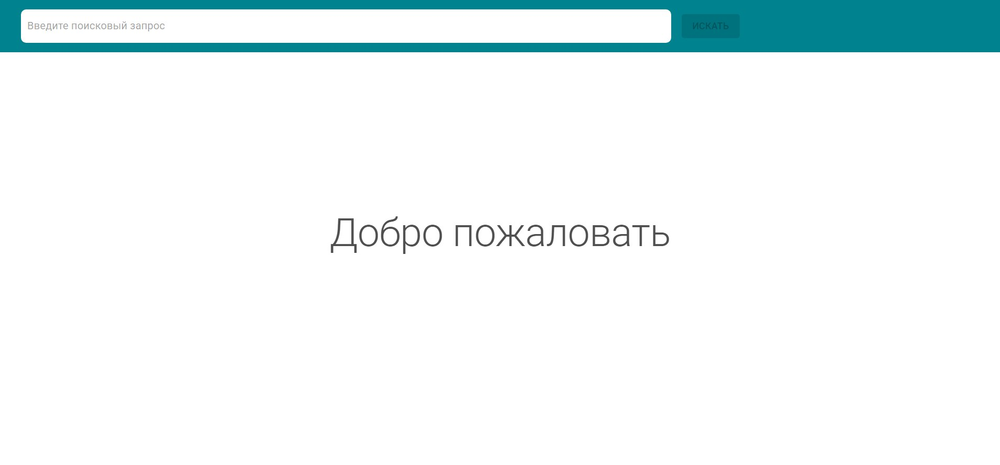
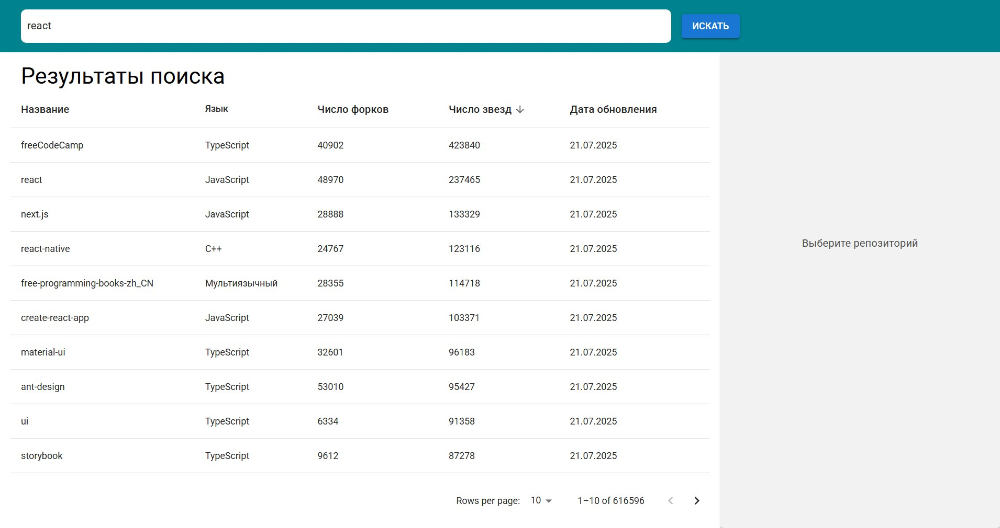
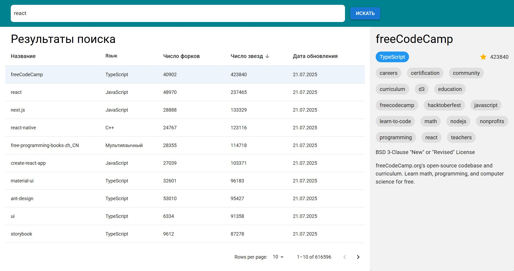
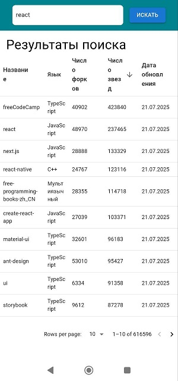
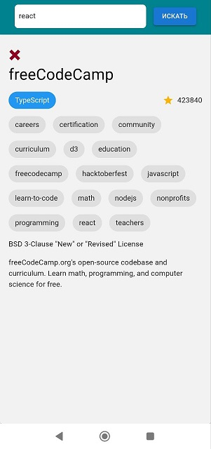

# Get Started

To host the website on your local machine, you need to:

- Install Node.js: https://nodejs.org/en/download
- Clone the repository
- Install dependencies by running **in PowerShell** the following command from the root directory: `npm i`
- Compile `.scss` styles
- Generate a **GitHub token**, add it to `.env.example`, then rename the file to `.env`
- Launch the application by running **in PowerShell** the following command from the root directory: `npm start`

# Screenshots

## Desktop  

### Start screen

### Table screen

### Info screen

## Mobile

### Start screen

### Table screen

### Info screen

